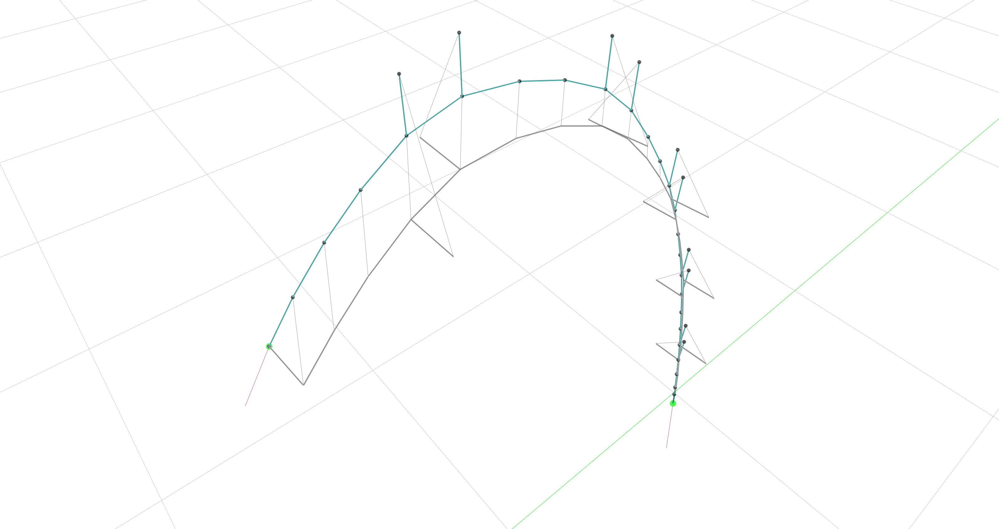

# JAX FDM

An automatically differentiable and GPU-capable version of the Force Density Method.



## Installation

First, create a new anaconda environment and activate it:

```bash
conda create --name fdm
conda activate fdm
```

Then, install `compas` and `compas_view`.

```bash
conda install compas compas_view2
```

Finally, install `JAX` using its [official documentation](https://github.com/google/jax#installation). If you want to install it for CPU support on MacOS or Linux, do:

```bash
pip install --upgrade pip
pip install --upgrade "jax[cpu]"
```

Enjoy 🍸!
