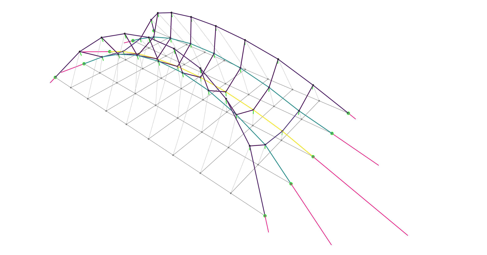

# dfdm

A differentiable implementation of the Force Density Method.
This library is tailored to the solution of constrained form-finding problems.



## Installation

First, create a new anaconda environment and activate it:

```bash
conda create --name dfdm
conda activate dfdm
```

Then, install `compas` and `compas_view`:

```bash
conda install compas
conda install compas_view2
```

Install `autograd`, our automatic differentiation backend:

```bash
pip install autograd
```

Finally, install this library from source as an editable package:

```bash
pip install -e .
```

Enjoy 🍸!


## License

MIT
